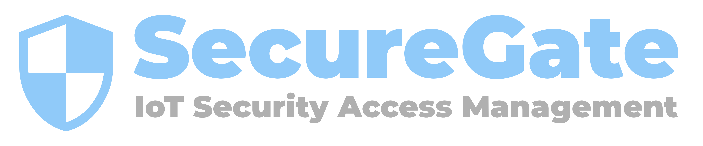
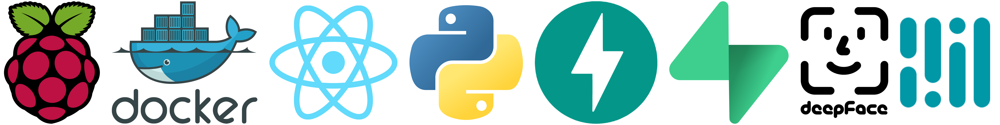

  
   
  
<strong>SETU - Higher Diploma in Computer Science</strong>
 
  
<strong>FINAL PROJECT</strong>
 
  

 

<strong>Commercial Title :</strong> SecureGate
 
<strong>Academic Title :</strong> IoT security project for granting controlled access to infrastructure using multi factor authentication

<!-- ABOUT THE PROJECT -->
## About The Project
SecureGate is an innovative security management system designed to provide robust access control and monitoring capabilities. The platform integrates cutting-edge authentication methods with user-friendly interfaces to ensure maximum security without compromising on usability.

This project demonstrates the implementation of multi factor authentication with a card reader, pin entry, and facial recognition. The system is built using Python FastAPI for the backend, SupaBase for a Realtime DB, React for the frontend and incorporates Material UI for a clean, professional appearance.

<!-- Devloped With -->
### SecureGate was developed using the following Technologies

<!-- SecureGate Showcase Website -->
## SecureGate Showcase Website
Link: <a href="https://securegate-kg.vercel.app/" target="_blank">https://securegate-kg.vercel.app/</a>

(<a href="#readme-top">back to top</a>)

# SecureGate Application Screenshots
Below are a select few screenshots of the application.. 

<!-- Sections -->
# Backend API

(<a href="#readme-top">back to top</a>)

# Frontend User Flows
### Administrator Flow

(<a href="#readme-top">back to top</a>)

### Cleaner Flow

(<a href="#readme-top">back to top</a>)

### User Flow

(<a href="#readme-top">back to top</a>)

# Admin Dashboard

### Anylitics Dashboard

(<a href="#readme-top">back to top</a>)

### Users Dashboard

(<a href="#readme-top">back to top</a>)

### Add User Step # 1 Dashboard

(<a href="#readme-top">back to top</a>)

### Add User Step # 2 Dashboard

(<a href="#readme-top">back to top</a>)

### Failed Logins Dashboard

(<a href="#readme-top">back to top</a>)

<!-- CONTACT -->
## Contact

Your Name - Kieron Garvey

Project Link: [https://github.com/ki321g/SecureGate](https://github.com/ki321g/SecureGate)

(<a href="#readme-top">back to top</a>)
